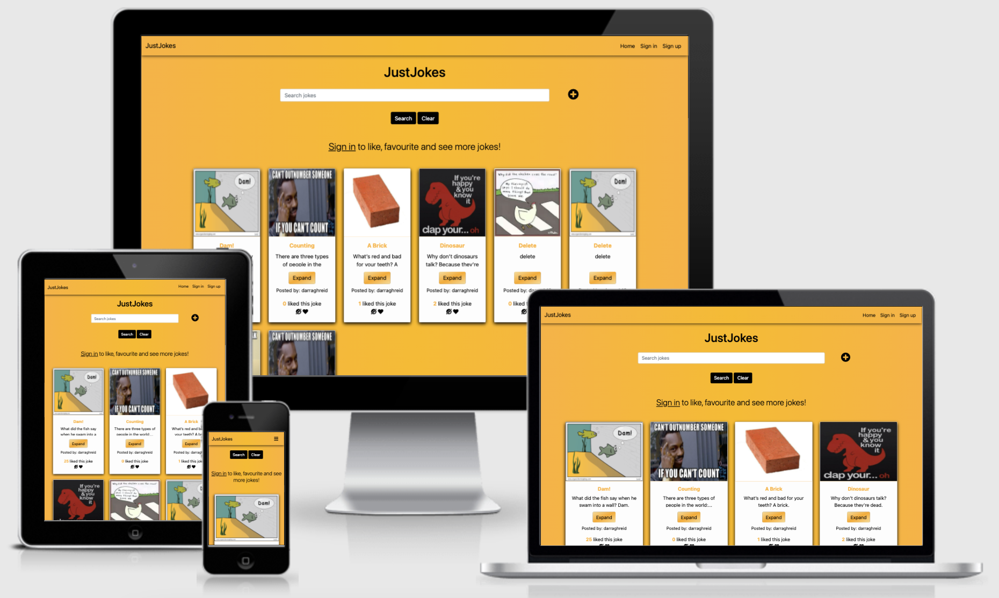
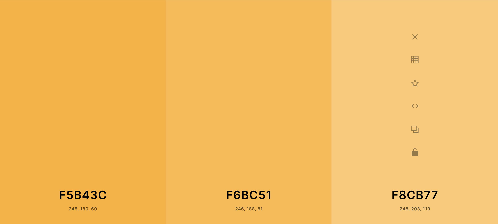

## Contents
* [Introduction](#Eden)
* [UX](#UX)
    * [User Stories](#User-Stories)
        * [First Time User Goals](#First-Time-User-Goals)
        * [Returning User Goals](#Returning-User-Goals)
        * [Site Owner Goals](#Site-Owner-Goals)
* [Structure](#Structure)
* [Design](#Design)
* [Wireframes](#Wireframes)
    * [Differences Between Wireframes and Final Product](#Differences-Between-Wireframes-and-Final-Product)
* [Features](#Features)
    * [Home Page](#Home-Page)
    * [Studio Section](#Studio-Section)
    * [Footer](#Footer)
    * [Potential Future Features](#Potential-Future-Features)
* [Technologies Used](#Technologies-Used)
    * [Languages Used](#Languages-Used)
    * [Frameworks, Libraries & Programs Used](#Frameworks-,-Libraries-&-Programs-Used)
* [Testing](#Testing)
* [Deployment](#Deployment)
    * [Project Creation](#Project-Creation)
    * [GitHub Pages](#GitHub-Pages)
    * [Forking the GitHub Repository](#Forking-the-GitHub-Repository)
    * [Run Locally](#Run-Locally)
* [Credits](#Credits)
    * [Code](#Code)
    * [Content](#Content)
    * [Media](#Media)
    * [Acknowledgements](#Acknowledgements)

# Eden

View the live project [here](http://just-jokes.herokuapp.com/get_jokes)

This website was created for Code Institute's Milestone 3 Project as part of the Diploma in Full Stack Web Development. The purpose of this project is to demonstrate the student's knowledge and skills acquired thus far in the course. This includes skills in HTML, CSS, JavaScript, Python, Flask as well as other technologies as outlined in the [Technologies Used](#Technologies-Used) section. The focus of this project is to demonstrate the student's ability to carry out CRUD functionality
This project marks the developer's first time writing Python and working with databases.

The purpose of this site is to provide users with a platform on which they create, read, update, and delete jokes. These features, as well as other features. such as liking jokes and adding jokes to favourites will be discussed in the [Features](#Features) section of this README.md. I decided that using jokes was fun way to explore CRUD functionality. With myself in mind as the site owner/admin, I began creating user stories.

## UX
### User Stories

#### First Time User Goals 
1. As a first time user, I want to immediately understand the purpose of the site.
2. As a first time user, I want to be able to easily navigate through the site to find what I'm looking for.
3. As a first time user, I want to instinctively know what to do in order to get started creating and interacting with jokes
4. As a first time user, I want to be able to read jokes.
5. As a first time user, I want to be able upload jokes.
6. As a first time user, I want to be able to edit my jokes.
7. As a first time user, I want to be able to delete my jokes.
8. As a first time user, I want to be able to "like" jokes.
9. As a first time user, I want to be able to add jokes to a list of my favourites.

#### Returning User Goals
1. As a returning user, I want to be immediately familiar with the layout of the site.
2. As a returning user, I want to be able to upload new jokes.
3. As a returning user, I want to be able to access the jokes I have uploaded.
5. As a returning user, I want to be able to access the jokes in my list of favourites.
6. As a returning user, I want to be able to remove jokes from my list of favourites.
7. As a returning user, I want to be able to "unlike" jokes.

#### Site Owner Goals
1. As the site owner, I want to be able to design gardens in real time for potential customers.
2. As the site owner, I want to be able to carry out all of the operations available to users.
3. As the site owner, I want to be able to carry additional operations than other users.
4. As the site owner, I want to be able to carry out all operations on all jokes, even if they are not my own.
5. As the site owner, I want to be able to be able to access information on all users.
6. As the site owner, I want to be able to be able to remove users from the platform, at my own discretion.
7. As the site owner, I want to be able to be able to restrict access to users who are under 18 years of age.
8. As the site owner, I want to be able to be able to restrict access to users who are not signed in or registered.

## Structure
JustJokes includes 10 web pages, with some pages being more versatile and able to show a variety of information depending on the user's age, account type, and preferences. All web pages inhered html, head, and body elements from a base.html template using jinja. They also inherit the navbar and footer from base.html.

    A fixed navbar ensures that all pages available to the specific user are never more than a click away. It also assits users on smaller devices to avoid exessive scrolling when navigating the site. Pagination has also been implemented to reduce scrolling for users. More on what each page does and how it functions will be discussed in the [Features](#Features) of the README.md.

## Design
* Colour Scheme
    * The colourscheme of the site was kept relatively simple. Because most pages were going to be data-focused, I didn't want the colourscheme to distract the user or cause further clutter.

        The colours used in the site were black, white, and variables of rgb(245, 180, 60), rgb(245, 188, 31), and rgb(245, 180, 60). 
        
        I found this orang/yellow colour suited the fun concept of JustJokes The background of each web page of this site in a linear gradient of these three RGB colours. I felt the linear gradient gave the site a bit more depth, making it slightly easier on the eye.

        Black is the main contrasting colour throughout the site. It tames the vibrancy of the orange/yellow and makes a good colour for headings and navigations elements.

        A slightly dulled white was used for the card elements, inut elements and in buttons.

        I used [coolers.co](https://coolors.co/) as a starting off point for choosing the colours

    

* Typography
    * The dominant font I chose for JustJokes was Noto Sans. I feel it gave the typography of the site a distinctive, but not distracting, look.

        The font was sourced from [Google Fonts](https://fonts.google.com/)

* Imagery
    * All images were sourced from websites which provide images for free. These websites are listed below along with the images that were sourced from them, as well as photographer details (where applicable):
        * [pngjoy.com](https://www.pngjoy.com/)
            * https://www.pngjoy.com/preview/w3z5l3p1l6j9b4_palm-palm-tree-top-view-png-hd-png/ (photographer unnamed)
            * https://www.pngjoy.com/preview/u9f1d4c1b0f6v1_hanging-plants-scientific-names-of-plants-animals-and/ (photographer unnamed)
            * https://www.pngjoy.com/preview/u5r5n3a6e7k8f7_white-rose-white-and-yellow-roses-png-transparent/ (photographer unnamed)
            * https://www.pngjoy.com/preview/f2k8p5x5a2p7j0_flower-crown-png-tumblr-white-flower-crown-transpa/ (photographer unnamed)
            * https://www.pngjoy.com/preview/z7m2e9e9x6z4h5_stone-path-nail-polish-transparent-png/ (photographer unnamed)
            * https://www.pngjoy.com/preview/z1l9n7s4a8p6r8_bush-bush-png-transparent-png/ (photographer unnamed)
            * https://www.pngjoy.com/preview/x1k3u4f2u0q7r8_tree-top-mango-tree-top-view-transparent-png/ (photographer unnamed)
            * https://www.pngjoy.com/preview/m5y3d1u8d3q6r2_bush-bushes-png-png-download/ (photographer unnamed)
            * https://www.pngjoy.com/preview/f3t5j5r2f9h7g0_tree-plan-fruit-tree-top-view-png-png/ (photographer unnamed)
            
        * [freeimages.com](https://www.freeimages.com/)
            * https://www.freeimages.com/photo/grass-1508240 (photographer: Philipp Pilz)
            * https://www.freeimages.com/photo/fresh-soil-1468423 (photographer: Mike Berg)
            * https://www.freeimages.com/photo/old-wood-texture-1154441 (photographer: Petr Kovar)
            
        * [pixaboy.com](https://pixabay.com/)
            * https://pixabay.com/photos/pebbles-decking-texture-model-3212192/ (photographer: _Alicja_)
            * https://pixabay.com/photos/flower-tropical-bougainvillea-3271195/ (photographer: Buntysmum)
    
    * Some images were edited by the developer to suit the needs of the site. The images that were edited include:
        * grass-2.png was edited from https://www.freeimages.com/photo/grass-1508240 (photographer: Philipp Pilz)
        * gravel-4.png was edited from https://pixabay.com/photos/pebbles-decking-texture-model-3212192/ (photographer: _Alicja_)
        * soil-1.png was edited from https://www.freeimages.com/photo/fresh-soil-1468423 (photographer: Mike Berg)

        These images were edited by cutting and pasting different parts of the images to create a larger image using [Google Slides](https://www.google.com/slides/about/).
    
    * It was important to find png images without any backgrounds in order for users to seamlessly place images on top of one another
    to give the impression that the garden elements are real.

## Wireframes
* Wireframe of Home Page

* Wireframe of Studio

* Wireframe of Tutorial Section (Not included in final product)

### Differences Between Wireframes and Final Product
* The most obvious difference between the wireframes and the final product is that the Tutorial section in the final product has been omitted. I had originally planned to record a tutorial of how to use the software. Upon completion of the software, however, I found that it was intuitive enough that a tutorial was not required. 

    I felt a tutorial section would have been of no benefit to the product and would not have contributed to the requirements set out 
    in the Assessment Handbook.

    This omission had a minor impact on the Home Page where the "Watch Tutorial" call-to-action button and the "Tutorial" link 
    in the navbar are not present in the final product.

* Another difference between the wireframe and the final product is the menu in the Studio section. The wireframe displays a 
text-based menu where each menu item would have a drop down menu of related images of garden elements.

    I felt it was more intuitive to lead with images rather than text. I felt that this is more in line with modern design software
    such as Balsamiq, for example.

    The text is only present when the user hovers over the image-based menu item.

* Finally, I chose to omit the social links from the footer as they would have served no purpose to the site and would not have 
contributed to the requirements set out in the Assessment Handbook.

## Features
#### Home Page

The Home Page is where the user is introduced to the site and takes up 100vh.
* The Home Page includes a responsive Bootstrap navbar displaying the logo as well as links to the two sections of the site. These links collapse into a dropdown button on smaller screens. The button that is seen on smaller screens is represented by a fontawesome icon, as the original button was having trouble displaying.

    These links, along with all clickable links throughout the site, highlight upon hover.

* The main feature of the Home Page is the background image of a garden that gradually builds itself on page load. The scene is comprised of multiple good resolution images. Therefore, when the site is first loaded (without cache), the images may not have fully loaded by the time they are brought onto the screen. However, this transition effect is seamless upon further reloads.

    The self-building image of a garden was designed with user intuition in mind. The user should immediately understand the purpose of the site upon seeing it. It is designed to be an exciting introduction to the Eden site.

    The garden scene is also responsive. The images change change in size and position depending on the screen size. On particularly small screens, the tree is replaced with a bush.

    NOTE: 
    * Each image in the garden scene has a different CSS transition period. Therefore, when resizing in Dev Tools, allow a few seconds for each image to transition to its appropriate size and position.

* The callout, which along with the call-to-action button, is brought on screen by the transition mentioned above, and provides further affirmation as to the purpose of the site.

* The call-to-action button brings the user straight to the Studio section where they can immediately begin designing.

#### Studio Section

The Studio section is where users can design their gardens. It takes up 90vh, with the remaining 10vh being occupied by the footer.
* At the very top of the Studio section is the header, which introduces and concisely details the purpose of the section.

* Beneath the header is a visually appealing, scrollable, image-based menu comprised of images of each of the garden elements available for the user to experiment with.

    This menu was designed to be intuitive for the user. The user should immediately understand that these images are clickable. Once clicked, the image displayed on that menu item should appear on the canvas below, ready to be manipulated.

    The menu is responsive. On larger screens the menu items are centred within the menu section. On smaller screens, it is laterally scrollable.

    This menu was inspired by a [w3schools](https://www.w3schools.com/howto/tryit.asp?filename=tryhow_css_menu_hor_scroll) scrollable menu, which underwent a good deal of editing due to significant differences in the site menu and the w3School example.

    Aside from all classes and ids being renamed, there are major structural differences. For example, the w3schools example is simply a list of anchor tags. Each menu item in the Studio section of Eden is comprised of four different elements including a two divs, and anchor tag, an image, and a paragraph tag. This required significantly more editing in style.css.

* The canvas section of the Studio is where users can manipulate the various garden elements that they have selected from the menu above. Each element that appears on the canvas is removable, moveable, and resizable. This allows the user to be creative in their designs. The canvas section has an overflow of hidden, thus the images cannot be moved onto other sections of the site.

#### Footer

The footer occupies the remaining 10vh and is comprised of two links, the Logo, and a back-to-top link, which encompasses an "up" fontawesome arrow icon. These links are located at the left and right of the footer, respectively. Both links lead to the Home Page.

#### Potential Future Features
Although the initial goal of creating a platform on which users can create rough garden designs has been achieved, a few possible additional features 
that could be implemented in future versions of the site came to mind throughout the creation process. These include:
* A larger selection of garden elements. These would, of course, be subject to the site owners preferences.
* The ability of the user to rotate images. This would be useful for rectangular elements, such as bushes.
* The ability of the user to crop images.
* The ability of the user to increase or decrease the z-index of the elements.
* The ability of the user to save their work. This could possibly involve the creation of an account.
* The ability of the user to shape their garden to match their own.

## Technologies Used 

### Languages Used 
* [HTML5](https://en.wikipedia.org/wiki/HTML5)
* [CSS3](https://en.wikipedia.org/wiki/CSS)
* [JavaScript](https://en.wikipedia.org/wiki/JavaScript)

### Frameworks, Libraries & Programs Used
* [Balsamiq](https://balsamiq.com/)
    * Balsamiq was used to make the wireframes for the project

* [Bootstrap 5.0.0](https://getbootstrap.com/docs/5.0/getting-started/introduction/)
    * Bootstrap was used in conjunction with [jQuery](https://jquery.com/) on the Navbar to make it responsive and to collapse the menu items into a single button at smaller screen sizes. Some edits were made to successfully implement the navbar into the site. For examplem me-auto was replaced with ms-auto to push the menu items to the right of the screen, .navbar-collapse was targeted in [style.css](assets/css/style.css) to push the dropdown menu items to the right, and bg-light was also removed to ensure the navbar was transparent.

* [Fontawesome](https://fontawesome.com/)
    * As mentioned in the [Features Section](#features), the dropdown menu button in the navbar is represented by a fontawesome icon. There is also a fontawesome icon used in the "back to top" link in the footer.
    
* [Git](https://git-scm.com/)
    * The Gitpod terminal was used to commit to Git and push to Github.

* [GitHub](https://github.com/)
    * Github was used to store the code from the project.

* [Google Dev Tools](https://developer.chrome.com/docs/devtools/)
    * Google Dev Tools was extensively used throughout the project, especially for testing code, and addressing bug.

* [Google Fonts](https://fonts.google.com/)
    * The two fonts used in the project (Roboto and Great Vibes) were imported from Google Fonts.

* [jQuery](https://jquery.com/)
    * jQuery was used in conjunction with Bootstrap on the Navbar.

* [Am I Responsive](http://ami.responsivedesign.is/)
    * Am I Responsive was used to produce the image displaying the website on different screen sizes at the beginning of this document.

* [Babel](https://babeljs.io/) compiler was used while trouble-shooting a bug where the site functionality wouldn't work on
Apple devices. I used babel to convert my JavaScript code ES5. This was unsuccessful in solving the issue, and the ES5 code was ultimately removed.

* [Autoprefixer](http://autoprefixer.github.io/) was used for the same reason as babel. I used Autoprefixer to add vendor prefixes to make it more compatible with various browsers and devices. It was also unsuccessful in addressing the bug. As well as this, as you will see in the Known Bugs section of [TESTING.md](/TESTING.md), it caused errors when put through the W3C CSS Validator. For these reasons, the prefixes were removed.

## Testing
Information on testing can be found in a separate [TESTING.md](/TESTING.md) file

## Deployment

### Project Creation
This project was created by using the following steps:

1. Log in to GitHub.
2. In the Repositories section, click the green "New" button.
3. Under "Repository template", select "Code-Institute-Org/gitpod-full-template".
4. Enter repository name (eden).
5. Click "Create repository".
6. When re-directed, select the green "Gitpod" button. 

### GitHub Pages
This project was deployed to GitHub Pages using the following steps:

1. Log in to GitHub.
2. Select repository.
3. Navigate to and click the "Settings" button.
4. When re-directed, scroll down to the "GitHub Pages" section.
5. Under "Source", click the dropdown named "None" and select "Master Branch".
6. Click the "Save" button.
7. Upon page refresh, scroll down and locate the link to the live deployed page.

### Forking the GitHub Repository

Forking the GitHub repository allows us to make a copy of our original repository where changes can be made without affect the original copy.
To do this, follow these steps:

1. Log in to GitHub.
2. Select your repository.
3. Locate and click the "Fork" in the top right corner, under the nav bar.
4. A copy of the original repository should have been created in your GitHub account.

### Run Locally

1. Log in to GitHub.
2. Locate repository.
3. Locate and click the "Code" dropdown menu.
4. Under HTTPS, copy the URL.
5. Open your development editor and a terminal window in your chosen directory.
6. In the terminal, type "git clone " followed by the URL you copied in step 4 and press enter.
7. A clone of the project should have been created.

## Credits

### Code 
* As discussed in the [Features Section](#Features), the scrollable menu in the Studio section was inspired by a [w3schools](https://www.w3schools.com/howto/tryit.asp?filename=tryhow_css_menu_hor_scroll) scrollable menu, and was heavily edited.

* I would also like to credit YouTuber [Jonas Grøndahl](https://www.youtube.com/channel/UCVrchtz0z4it4JZjIS1D03A) whose videos on creating moveable and resizable divs I watched. 

    Jonas' videos can be viewed here:
    * https://www.youtube.com/watch?v=NyZSIhzz5Do
    * https://www.youtube.com/watch?v=4qyuNBlc8ho

* A YouTube account by the name of [Fl05k8r](https://www.youtube.com/channel/UCQlg1ZNEkVGZ8aUB4gcu-Sg) made a comment on Jonas' [part 1](https://www.youtube.com/watch?v=NyZSIhzz5Do) video which added to my understanding of targeting multiple elements for 
moving.

* [Stack Overflow](https://stackoverflow.com/) member, Jor, contributed some code in the comments of [this post](https://stackoverflow.com/questions/13152578/create-a-draggable-div-in-native-javascript) 
which greatly helped in my understanding of how to target elements on touch screens.

As is evident from comparing my code to the code from the sources above, my code is very different. 

This is partly because of the complexity of my project as opposed to the explanatory code referenced above. Of course, all functions, variables, classes and ids have been changed. However, much more needed to be done to implement moveable and resizable functionality into my project, as well as to include the removable functionality. Added layers of complexity included the functionality being written for elements that don't yet exist in the DOM and also that the moveable and resizable elements were nested inside other elements.

Further details of the bugs encountered in the project can be found in the Known Bugs Section of the [TESTING.md](/TESTING.md).

### Content 
* All content was created by the developer.

### Media
* As mentioned in the [Features Section](#features), all images on this site were sourced from sites which provide images for free. They are referenced in the Features Section, as well as in [index.html](/index.html). As previously discussed, some images were edited by the developer to suit the needs of the site.

### Acknowledgements
I would like to thank my mentor Gurjot Singh for his continuous support throughout the project.
I would like to thank friend John Brett for his hands-off advice.
I would like to thank the slack community for their assistance, particularly Daisy Mc Girr who is always willing to share her wisdom and advice.