## Contents
* [Introduction](#JustJokes)
* [UX](#UX)
    * [User Stories](#User-Stories)
        * [First Time User Goals](#First-Time-User-Goals)
        * [Returning User Goals](#Returning-User-Goals)
        * [Site Owner Goals](#Site-Owner-Goals)
* [Structure](#Structure)
* [Design](#Design)
* [Wireframes](#Wireframes)
    * [Differences Between Wireframes and Final Product](#Differences-Between-Wireframes-and-Final-Product)
* [Database Design](#Database-Design)
* [Features](#Features)
    * [Admin](#Admin)
    * [General User](#General-User)
    * [Under 18s User](#Under-18-User)
    * [Signed out user](#Signed-Out-User)
* [Potential Future Features](#Potential-Future-Features)
* [Technologies Used](#Technologies-Used)
    * [Languages Used](#Languages-Used)
    * [Frameworks, Libraries & Programs Used](#Frameworks-,-Libraries-&-Programs-Used)
* [Testing](#Testing)
* [Security](#Security)
* [Deployment](#Deployment)
    * [Project Creation](#Project-Creation)
    * [Connecting to Heroku](#Heroku)
    * [Forking the GitHub Repository](#Forking-the-GitHub-Repository)
    * [Run Locally](#Run-Locally)
* [Credits](#Credits)
    * [Code](#Code)
    * [Content](#Content)
    * [Media](#Media)
    * [Acknowledgements](#Acknowledgements)

# JustJokes

View the live project [here](http://just-jokes.herokuapp.com/get_jokes)

This website was created for Code Institute's Milestone 3 Project as part of the Diploma in Full Stack Web Development. The purpose of this project is to demonstrate the student's knowledge and skills acquired thus far in the course. This includes skills in HTML, CSS, JavaScript, Python, Flask as well as other technologies as outlined in the [Technologies Used](#Technologies-Used) section. The focus of this project is to demonstrate the student's ability to carry out CRUD functionality
This project marks the developer's first time writing Python and working with databases.

The purpose of this site is to provide users with a platform on which they create, read, update, and delete jokes. These features, as well as other features. such as liking jokes and adding jokes to favourites will be discussed in the [Features](#Features) section of this README.md. I decided that using jokes was fun way to explore CRUD functionality. With myself in mind as the site owner/admin, I began creating user stories.

## UX
### User Stories

#### First Time User Goals 
1. As a first time user, I want to immediately understand the purpose of the site.
2. As a first time user, I want to be able to easily navigate through the site to find what I'm looking for.
3. As a first time user, I want to instinctively know what to do in order to get started creating and interacting with jokes
4. As a first time user, I want to be able to read jokes.
5. As a first time user, I want to be able upload jokes.
6. As a first time user, I want to be able to edit my jokes.
7. As a first time user, I want to be able to delete my jokes.
8. As a first time user, I want to be able to "like" jokes.
9. As a first time user, I want to be able to add jokes to a list of my favourites.
10. As a first time user, I want to be able to search for specific jokes.

#### Returning User Goals
1. As a returning user, I want to be immediately familiar with the layout of the site.
2. As a returning user, I want to be able to upload new jokes.
3. As a returning user, I want to be able to access the jokes I have uploaded.
5. As a returning user, I want to be able to access the jokes in my list of favourites.
6. As a returning user, I want to be able to remove jokes from my list of favourites.
7. As a returning user, I want to be able to "unlike" jokes.

#### Site Owner Goals
1. As the site owner/admin, I want to be able to have additional features available to me.
2. As the site owner/admin, I want to be able to see all jokes that have been uploaded by users.
3. As the site owner/admin, I want to be able to delete any joke on the platform that I see fit.
4. As the site owner/admin, I want to be able to edit any joke on the platform that I see fit.
5. As the site owner/admin, I want to be able to access the information of all users of the site.
6. As the site owner/admin, I want to be able to remove any user I see fit from the site.
7. As the site owner/admin, I want to be able to search for specific users.

## Structure
JustJokes includes 10 web pages, with some pages being more versatile and able to show a variety of information depending on the user's age, account type, and preferences. All web pages inhered html, head, and body elements from a base.html template using jinja. They also inherit the navbar and footer from base.html.

A fixed navbar and a footer ensure that all pages available to the specific user are never more than a click away. This also assists users on smaller devices to avoid excessive scrolling when navigating the site. Pagination has also been implemented to reduce scrolling for users. More on what each page does and how it functions will be discussed in the [Features](#Features) of the README.md.

## Design
* Colour Scheme
    * The colour scheme of the site was kept relatively simple. Because most pages were going to be data-focused, I didn't want the colour scheme to distract the user or cause further clutter.

        The colours used in the site were black, white, and variables of rgb(245, 180, 60), rgb(245, 188, 31), and rgb(245, 180, 60). 
        
        I found this orang/yellow colour suited the fun concept of JustJokes The background of each web page of this site in a linear gradient of these three RGB colours. I felt the linear gradient gave the site a bit more depth, making it slightly easier on the eye.

        Black is the main contrasting colour throughout the site. It tames the vibrancy of the orange/yellow and makes a good colour for headings and navigations elements.

        A slightly dulled white was used for the card elements, input elements and in buttons.

        I used [coolers.co](https://coolors.co/) as a starting off point for choosing the colours

    

* Typography
    * The dominant font I chose for JustJokes was Noto Sans. I feel it gave the typography of the site a distinctive, but not distracting, look.

        The font was sourced from [Google Fonts](https://fonts.google.com/)

* Imagery
    * the only images displayed on the site are uploaded by users themselves and are displayed alongside the uploaded joke in a card format.

    * Images are uploaded to the site via url, using the image url input in the "Add Joke" form. Having users add images to their jokes adds an extra fun element. It makes the user experience more enjoyable and makes the site more interesting. Memes are also very popular in other social media websites.

        The images are chosen at the discretion of the user. The user is, however, instructed to ensure that the image is somewhat related to the joke. This can be moderated by the admin, who can remove jokes at their discretion.

## Wireframes
* Wireframe of Home Page

### Differences Between Wireframes and Final Product
* On the home screen, I decided to omit the sort by dropdown as I didn't feel it would contribute to the project according to the guidelines set out in the Assessment Handbook. Also, I had already included a dropdown in the Profile page where users are presented with a range of options.

* Having dropped the dropdown, I decided I would include the number of user's who had liked a particular joke in the card display. This feature adds to the UX of the site.

* I had originally planned on manipulating the card to show the full joke, if the joke's characters exceeded the characters able to be displayed on the card. I felt a modal displaying the full joke would be a better design a lead to a better user experience. Bootstrap modals are a prominent feature throughout the site.

* As discussed above, the links to toggle between the user's uploaded jokes and the user's favourite jokes, were replaced with a dropdown menu with the additional option to sign out. I felt this was more of an intuitive layout that users would be used to from social media platforms.

* Icons were omitted from the forms. I had intentionally left them to do if I had time, as I didn't think they were very important. In the end, time didn't allow to include them.

* In sign in form, instead of a switch indicating whether the user was an adult or not, I opted for a calendar input. I sliced the information I needed from the user's DOB string and calculated their ages. Different features are available to users based on their age, as will be discussed in the [Features](#Features) section.

* The 404 and 500 error pages were created towards the end of the project. They were not included in the initial planning of the project.

## Database Design
MongDB was chosen to create the database for this project. Its non-relational structure was suited for the site's needs as there are few relationships between the collections in the just_jokes database.

### Database structure
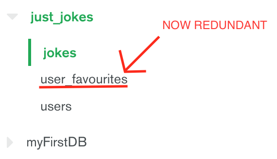

There are currently two collections in use; jokes and users. A third, user_favourites, had been used for a period of time, but is now redundant. As will be discussed in the Bugs section in [TESTING.md](/TESTING.md), a more efficient means of adding jokes to user's list of favourites was found.

#### Users Collection
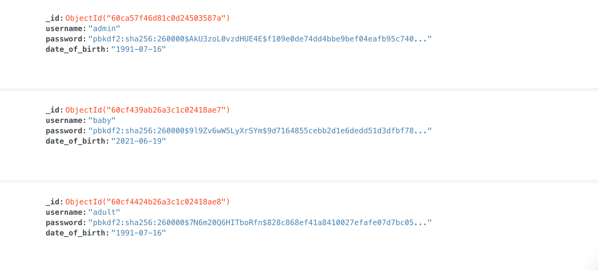

The Users collection is comprised of three fields, excluding "_id". "username", "password" and "date_of_birth" are all pulled from the sign up form after being entered by the user. 

"username" is the most widely used of the field in the site. It is used to identify if a user has liked a joke or added a joke to their list of favourites. It is also displayed on card of the jokes they have uploaded.

"date_of_birth" is an important field. It is used in the get_age() function in app.py to determine the user's age and, therefore, what content they will be able to see.

As you can see, the user's password is securely stored, hashed and salted for security.

#### Jokes Collection
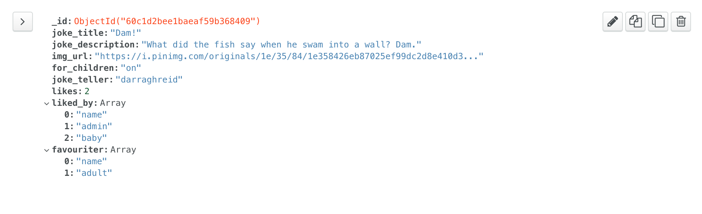

The number of fields in the jokes collection as grown since its inception at the beginning of the project. Not only does it hold information about the joke, but it also stores information about the popularity of the jokes and the users who have interacted with the joke.

"joke_title", "joke_description", "img_url" and "for_children" are all input by the user via the Add Joke form and add_joke() function in app.py. 

"for_children" is an important field. It is set to "on" or "off" via a switch in the Add Joke form. If it is set to "on", all users will be able to see the joke. If it is set to "off", only adult users will be able to see the joke.

"likes", "liked_by" and "favouriter" are automatically added alongside the other fields upon upload. They will be continuously updates as users interact with the joke.

"likes" is an integer and is initialised with 0. This will increase when a user "likes" the joke and will decrease when a user "unlikes" a joke.

"liked_by" is a MongoDB array, and stores the names of users who have liked its respective joke. Usernames will be removed from the array upon the user unliking the joke.

"favouriter" is also a MongoDB array, and stores the names of users who have added its respective joke to their list of favourites. Usernames will be removed from the array upon the user removing the joke from their favourites.

#### User Favourites Collection
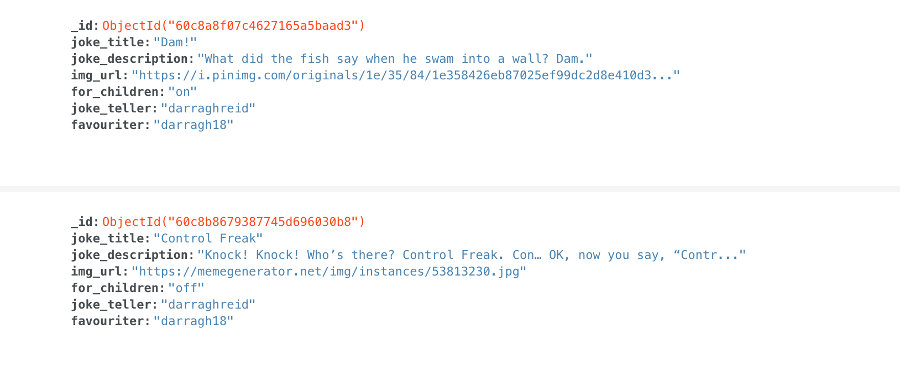

Although no longer in user, this is how the user-favourites collection functioned. Each time a user added a joke to their favourites, information about the joke was passed to the add_fav() function, and inserted into the collection along with the name of the user who favourited it.

## Features
Different features are available to users based on their age and the type of account they have, ie; a general user, or an admin. I will discuss these features in relation to these criteria.

#### Admin
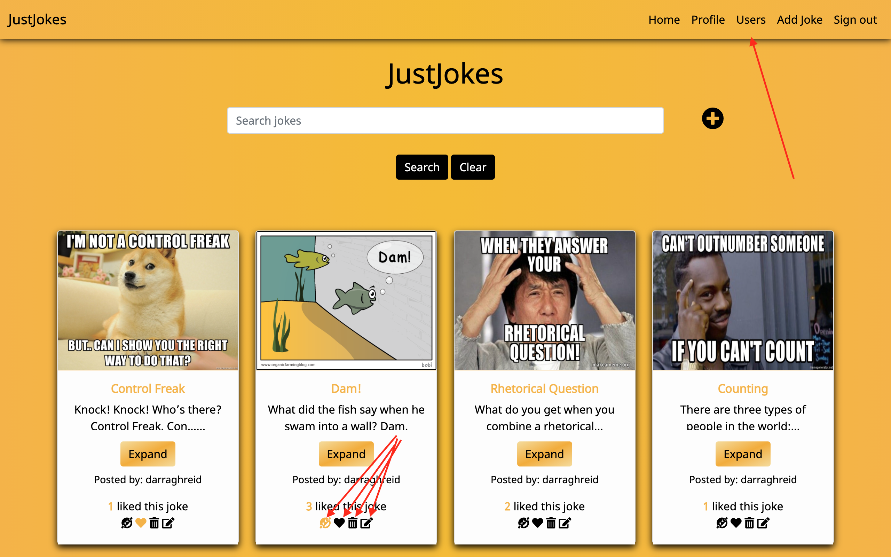
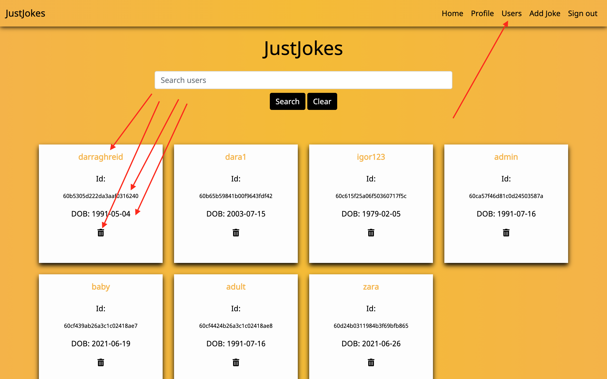

* All features are available to the admin. The Home, Profile, Users, Add Jokes, and Sign Out pages are visible on the admin's navbar.

* On the Home page, the admin can see all jokes that are stored in the jokes collection in mongo db. The jokes are displayed on Bootstrap cards that display detail of the joke including the image, title, description, who posted the joke, and the number of likes it has.

    They can like, unlike, add to favourites, remove from favourites, edit, and delete any joke they choose, without restriction. Liking the joke will add 1 to the "likes" field of the joke and add the user's name to the list of other users who liked the array, which is the joke's "liked_by" array field in the database. Unliking the joke will reverse this action

    Adding a joke to the user's favourites will result in the user's name being added to a list of other users who added the joke to their favourites, which is the joke's "liked_by" array field in the database. The joke will then be displayed in the "Your Favourites" section of their profile. Removing the joke from their favourites will reverse this action.

    A user can tell if they have liked or removed a joke from their favourites by the colour change in their respective icon. Yellow means the joked has been liked or favourited, while black means it has not be liked or favourited.

    The admin can also click the "Expand" button on the joke card, which will trigger a modal that will display the full joke. The joke on the card is capped at 50 characters.

    The admin can also search all jokes from the Home page using the search bar at the top of the page.

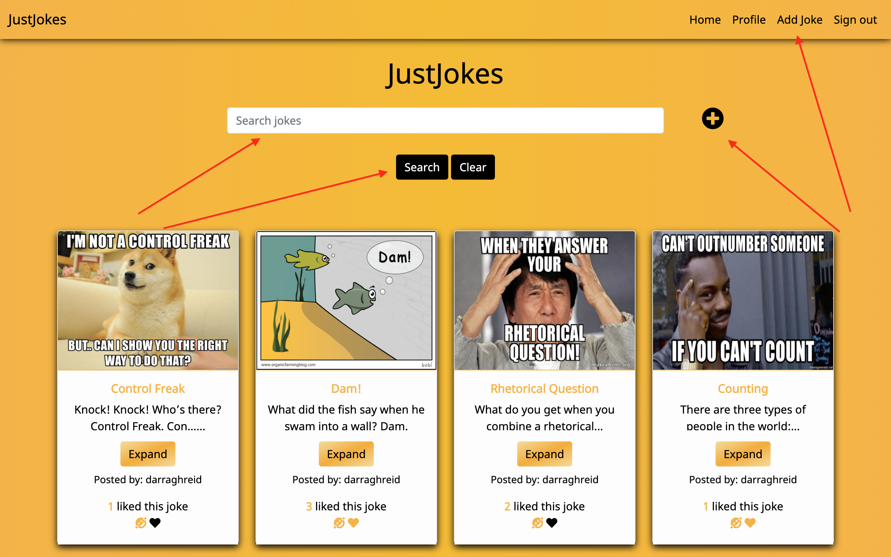
* Beside the search bar, there is an "add" icon which will lead them to the Add Joke page, where they can upload a joke to the site. This page can also be accessed from the sticky navbar at any time.

    As seen in the [Wireframes](#Wireframes) section, the Add Joke page is comprised of a form that takes information about the joke. This information includes the jokes, title, description, an images, related to the joke, and whether or not it is suitable for under 18s. 
    
    This information, along with additional information is then inserted into the jokes collection in MongoDB. The additional fields include the user who uploaded the joke, and the "likes", "liked_by", and "favouriter" fields discussed above.

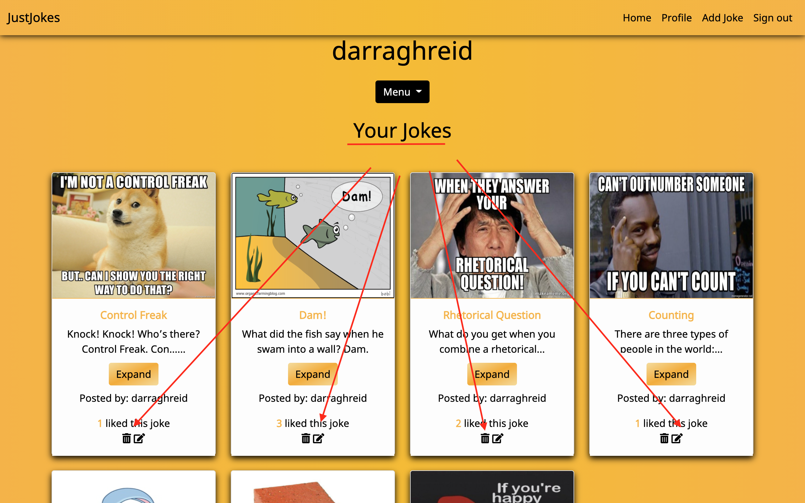
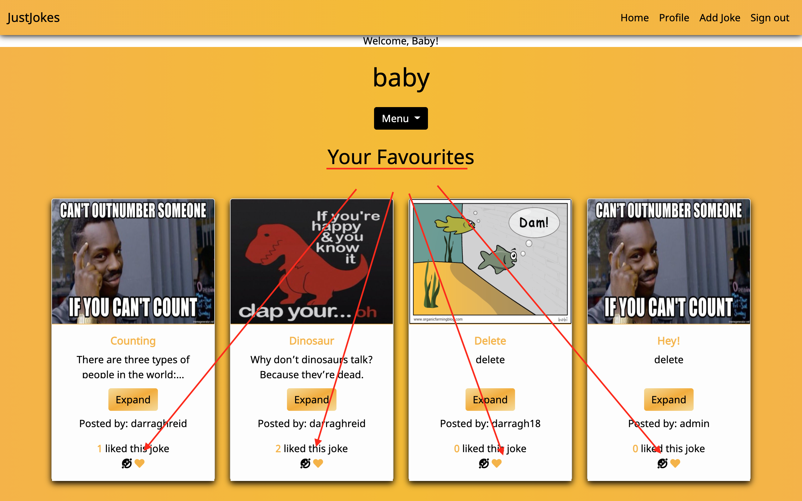
* In their profile, the admin can access the jokes that they have uploaded themselves, as well as the jokes that they have added to their favourites via a dropdown menu. The dropdown menu also allows users to sign out.

* The Admin user also has access to a Users page, where they can view all users who have signed up to the site. They can see all available information about the user, including their ID, username, and date of birth. Here, the admin can also chose to delete a user at their own discretion.

#### General User

* The general user has a more restricted version of the site available to them. They can access all the pages available to the admin user, except for the Users page

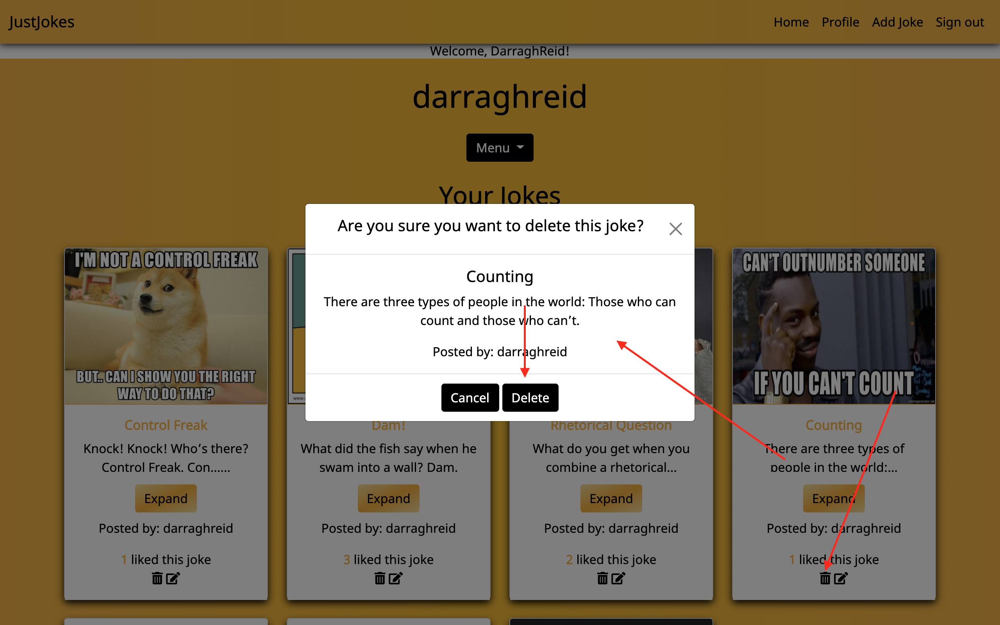
* All other pages are identical to the admin's version, except for the actions available to them. They can only edit or deleted a joke that they have uploaded themselves. 

    If the joke as been uploaded by another user, the only options available to them is the ability to like a joke or add a joke to their favourites.

    If they have uploaded the joke themselves, the only available options are to edit or delete the joke

#### Under 18 User
* Users under 18 years of age have an almost identical account as a general user. The only difference between the accounts is that users that are under 18 years of age may only see jokes that were marked "Suitable for children" in the Add Joke form.

#### Signed Out User
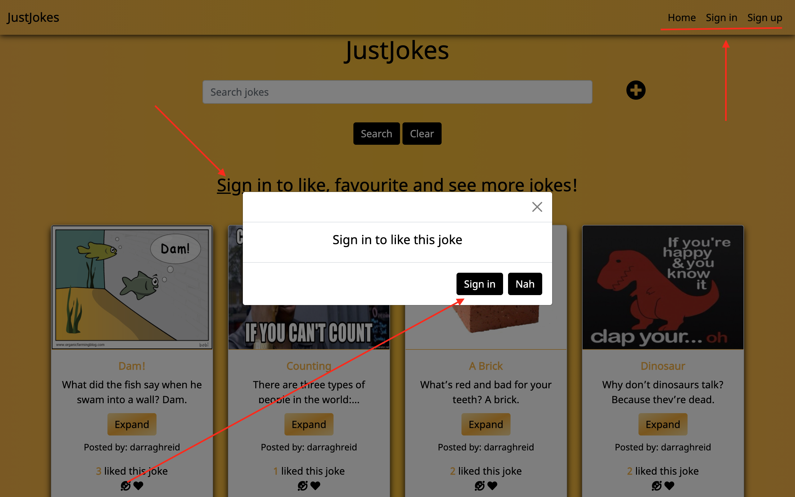
* A user who has not signed up or has not signed in, can access the most restricted version of the site. They have the Home, Sign up and Sign in pages available to them.

* Their access to the Home page is similar to the Under 18 user's. Like users under 18 years of age, they may only see jokes suitable for children. However, unlike other users, if they try to take any action, such as trying to see the full joke, liking, or adding the joke to their favourites, the will be presented with a modal providing them with the option of signing in. They can agree or decline.

* If the agree, they are led to the Sign Up page, where they enter their username, password and date of birth. Upon completing this action, they are uploaded to the users collection in the database. They are then considered a general user and redirected to their Profile page. Thanks to [Werkzeug](https://palletsprojects.com/p/werkzeug/), their password are securely stored and.

[Werkzeug's](https://palletsprojects.com/p/werkzeug/) check_password_hash() allows all users to securely sign in again.

## Potential Future Features
#### Categories
* There are many types of categories that jokes could be grouped into. This features would allow users to search for their favourite jokes based on a category. Possible categories might include: Dad Jokes, One-liners, Blonde jokes, and even memes!

#### Sort By
* I had originally planned to include this features, but chose to omit it, as discussed above. Users could use this feature to filter jokes based on their popularity, length, upload date, etc. It would allow users more control over what they see.

#### Shuffle
* An interesting future feature would allow users to shuffle through jokes. The users would press the shuffle button and one random joke would appear on their screen at a time.

#### Originals
* Another option would be to be allow users specify whether the joke they are uploading is original or not. They could possibly gain a following of users who enjoy their jokes.

#### Possibly Offensive Content
* Some jokes may be tagged with a warning that it might include content that some may find offensive.

## Technologies Used 

### Languages Used 
* [HTML5](https://en.wikipedia.org/wiki/HTML5)
* [CSS3](https://en.wikipedia.org/wiki/CSS)
* [JavaScript](https://en.wikipedia.org/wiki/JavaScript)
* [Python](https://en.wikipedia.org/wiki/Python_(programming_language))
    * [Jinja](https://en.wikipedia.org/wiki/Jinja_(template_engine))

### Frameworks, Libraries & Programs Used
* [Balsamiq](https://balsamiq.com/)
    * Balsamiq was used to make the wireframes for the project

* [Bootstrap 5.0.0](https://getbootstrap.com/docs/5.0/getting-started/introduction/)
    * Bootstrap was used in conjunction with [jQuery](https://jquery.com/) extensively throughout the site.
    
        It was used on the Navbar to make it responsive and to collapse the menu items into a single button at smaller screen sizes.

        Initialized with [jQuery](https://jquery.com/), the tooltips on all icons throughout the site are Bootstrap features 

        More prominently it was used to create the card elements that the jokes were displayed on. Bootstrap is also responsible for all modals seen throughout the site. Bootstrap classes were often used instead of CSS on other elements to assist with centering and positioning.

        Of course, extensive editing had to be carried out on all Bootstrap elements throughout the site to get it functioning a looking the way it currently is. 

* [Fontawesome](https://fontawesome.com/)
    * All icons seen throughout the site were sourced from Fontawesome, including the dropdown menu button in the navbar.
    
* [Git](https://git-scm.com/)
    * The Gitpod terminal was used to commit to Git and push to Github.

* [GitHub](https://github.com/)
    * Github was used to store the code from the project.

* [Google Dev Tools](https://developer.chrome.com/docs/devtools/)
    * Google Dev Tools was extensively used throughout the project, especially for testing code, and addressing bugs.

* [Google Fonts](https://fonts.google.com/)
    * Noto Sans, the font used throughout the site, was sourced from Google Fonts.

* [jQuery](https://jquery.com/)
    * jQuery was used in conjunction with Bootstrap on various elements throughout the site.

* [MongoDB](https://www.mongodb.com/)
    * MongoDB was used to creates collections within a database to store data about the sites registered users and jokes uploaded by them.

* [Flask Paginate](https://pythonhosted.org/Flask-paginate/)
    * Flask paginate was used for pagination in the Home and Profile pages.

* [Coolers.co](https://coolors.co/)
    * Coolers was used to help choose the colour palette seen throughout the site.

* [Am I Responsive](http://ami.responsivedesign.is/)
    * Am I Responsive was used to produce the image displaying the website on different screen sizes at the beginning of this document.

## Testing
Information on testing can be found in a separate [TESTING.md](/TESTING.md) file.

## Security
All sensitive information is stored in an env.py file. This file is referenced in a .gitignore file, and is therefore never pushed to GitHub. 

Any user that registers an account will have their password undergo password hashing as an extra security measure. Various measures are in place to ensure that only the admin and users themselves can access user information. 

These measures, which include function decorators and if statements, also ensure that users that are under 18 years of age cannot access adult content. As well as this, users that aren't signed in are restricted from accessing certain features

## Deployment

### Project Creation
This project was created by using the following steps:

1. Log in to [GitHub](https://github.com/).
2. In the Repositories section, click the green "New" button.
3. Under "Repository template", select "Code-Institute-Org/gitpod-full-template".
4. Enter repository name (just_jokes).
5. Click "Create repository".
6. When re-directed, select the green "Gitpod" button to open workspace. Only do this step once; open workspace from [Gitpod Workspaces](https://gitpod.io/workspaces/) in future. 

Use [Git](https://git-scm.com/) CLI commands for version control:
* To move files to the staging area, use "git add" followed by the name of the file, or "git add -A" for all files.
* To save your changes to your local repository, use "git commit -m" followed by a short, descriptive message detailing the changes you have made. Ensure the message is wrapped in quotes.
* To push the changes to the GitHub repo, use "git push".

### Heroku
This project was deployed to Deployment to Heroku using the following steps:

1. Set up a requirements.txt file and a Procfile to tell Heroku which applications and dependencies are required.
    * Type "pip3 freeze --local > requirements.txt" to create a requirements.txt file.
    * Type "echo web: python app.py > Procfile" to creat a Procfile.

2. Create Heroku App
    * Log into [Heroku](https://id.heroku.com/login).
    * Click the "New" button in the top right corner of the page, and select create new app.
    * Enter app name and select the region closest to you ("Europe" in this case).

3. Connect Heroku to Github
    * Click on the "Deploy" tab, select "GitHub", and then "Connect to GitHub".
    * When a prompt appears to find a github repository to connect to, enter the repo name created on Github ("just_jokes" in this case)
    * Click search, and click the connect button if the correct repository has been found.

4. Set environment variables
    * Click on the "Settings" tab, then "Reveal Config Vars", and add the following information:
        * key: IP, value: 0.0.0.0
        * key: MONGO_DBNAME, value: database name(just_jokes, in this case)
        * key: MONGO_URI, value: (This value is found in Mongo DB by accessing "clusters" then "connect" then "connect to your application". You will also have to add in your own database name and password.)
        * key: PORT, value: 5000
        * key: SECRET_KEY, value: (Custom secret key set up for configuration to keep client-side sessions secure)

5. Enable automatic deployment
    * Click the "Deploy" tab.
    * Choose the branch you wish to deploy and" click Enable Automation Deploys".

### Forking the GitHub Repository

Forking the GitHub repository allows us to make a copy of our original repository where changes can be made without affect the original copy.
To do this, follow these steps:

1. Log in to GitHub.
2. Select your repository.
3. Locate and click the "Fork" in the top right corner, under the nav bar.
4. A copy of the original repository should have been created in your GitHub account.

### Run Locally

1. Log in to GitHub.
2. Locate repository.
3. Locate and click the "Code" dropdown menu.
4. Under HTTPS, copy the URL.
5. Open your development editor and a terminal window in your chosen directory.
6. In the terminal, type "git clone " followed by the URL you copied in step 4 and press enter.
7. A clone of the project should have been created.

## Credits

### Code 
* [Ed Bradley's](https://github.com/Edb83) pagination code was a great template for learning how to implement my own. His code can be found [here](https://github.com/Edb83/self-isolution/blob/master/app.py).

* I learned how to make the 404 and 500 error pages from [this resource](https://flask.palletsprojects.com/en/1.1.x/patterns/errorpages/).

* [This](https://www.youtube.com/watch?v=RjMbCUpvIgw) video from [Socratica](https://www.youtube.com/user/SocraticaStudios) and [this](https://www.youtube.com/watch?v=NWDQDLzqMt8) video from [Irfan Khan](https://www.youtube.com/channel/UCK5QUBOwyE9cAaO0SV1etyQ) were very helpful in understanding how to calculate the user's age.

* [This](https://codeconvey.com/footer-at-bottom-of-page-but-not-fixed/) post helped me to keep my footer stuck to the bottom of the page when there was no information displayed on the screen.

Further details of the bugs encountered in the project can be found in the Known Bugs Section of the [TESTING.md](/TESTING.md).

### Content 
* The site was created solely by the developer. All jokes are uploaded by different users.

### Media
* All images seen on the site are uploaded by users as urls as part of the process of adding a joke. The site does not own the copyright to these images.

### Acknowledgements

I would like to thank the slack community for their assistance, particularly Daisy Mc Girr who is always willing to share her wisdom and advice. Igor Busaga's hands-off assistance and patience was also very much appreciated.