# Testing

## Contents
* [Validation](#validation)
    * [W3C Markup Validator](#W3C-Markup-Validator)
    * [W3C CSS Validator Services](#W3C-CSS-Validator-Services)
    * [JSHint](#JSHint)
    * [Lighthouse](#lighthouse)
* [Testing User Stories](#Testing-User-Stories)
    * [First Time User Goals](#First-Time-User-Goals)
    * [Returning User Goals](#Returning-User-Goals)
    * [Site Owner Goals](#Site-Owner-Goals)
* [Testing Features](#Testing-Features)
    * [Navigation](#Navigation)
    * [Home Page Functionality](#Home-Page-Functionality)
    * [Hover Effects](#Hover-Effects)
    * [Click and Appear Functionality](#Click-and-Appear-Functionality)
    * [Removable Functionality](#Removable-Functionality)
    * [Moveable Functionality](#Moveable-Functionality)
    * [Resizable Functionality](#Resizable-Functionality)
* [Site Responsiveness](#Site-Responsiveness)
* [User Testing](#User-Testing)
* [Known Bugs and Issues Section](#known-bugs-and-issues)

## Validation

[W3C Markup Validator](https://validator.w3.org/), [W3C CSS Validator Services](https://jigsaw.w3.org/css-validator/),  [JSHint](https://jshint.com/) and [Pep8 Online](http://pep8online.com/) were used to validate this project's code and to make sure there were no syntax errors in the project.

[Lighthouse](https://developers.google.com/web/tools/lighthouse) was used to test the site's performance.

### W3C Markup Validator
More information about issues that arose when validating my HTML can be found in the Problems section. As of writing, all errors have been resolved, and each HTML page passes throught the validator without any errors. However, they do come with the following warning: 
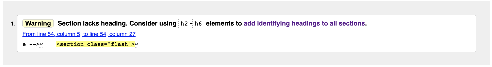

The W3C Markup Validator warned me that the flash section doesn't have a heading. The flash section extends from the base template. Therefore, all pages came with this warning, when validated. I inserted a heading into the flash section. However, the warning remained.

### W3C CSS Validator Services
CSS code from style.css passed through the [W3C CSS Validator Services](https://jigsaw.w3.org/css-validator/) without issue.
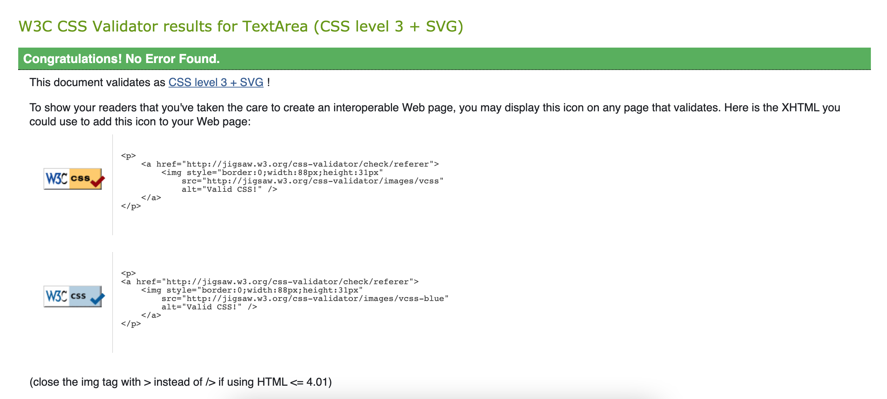

### JSHint
[JSHint](https://jshint.com/) flagged 10 warnings, which related to use of ES6 syntax:
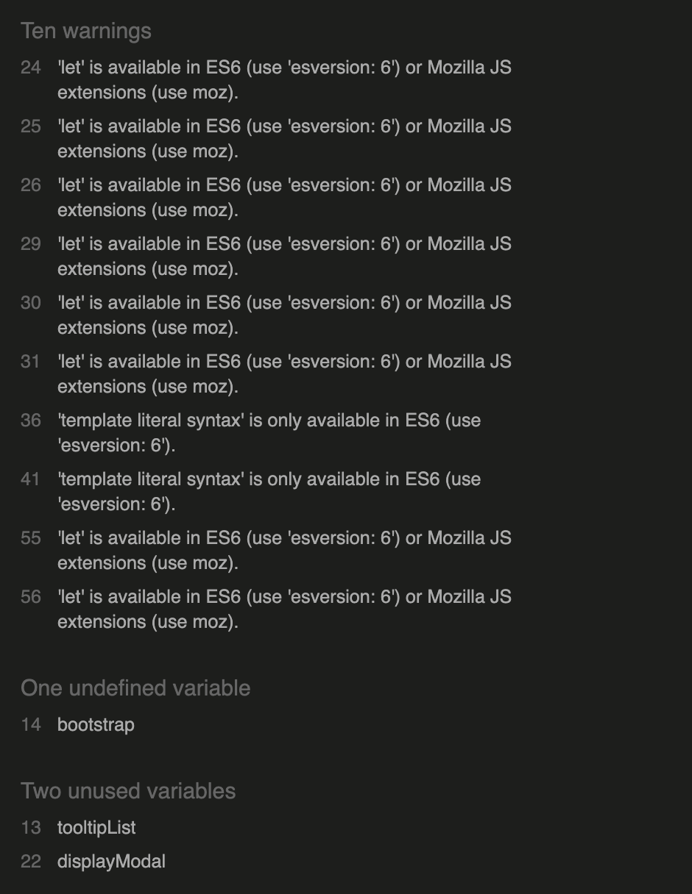

It also noted that the Bootstrap tooltip initialisation code included an undefined variable and an unused variable.

Finally, it marked by displayModal function as unused, perhaps because it is called inside the HTML using an onclick attribute.

### Pep8 Online
Python code from app.py passed through [Pep8 Online](http://pep8online.com/) without issue
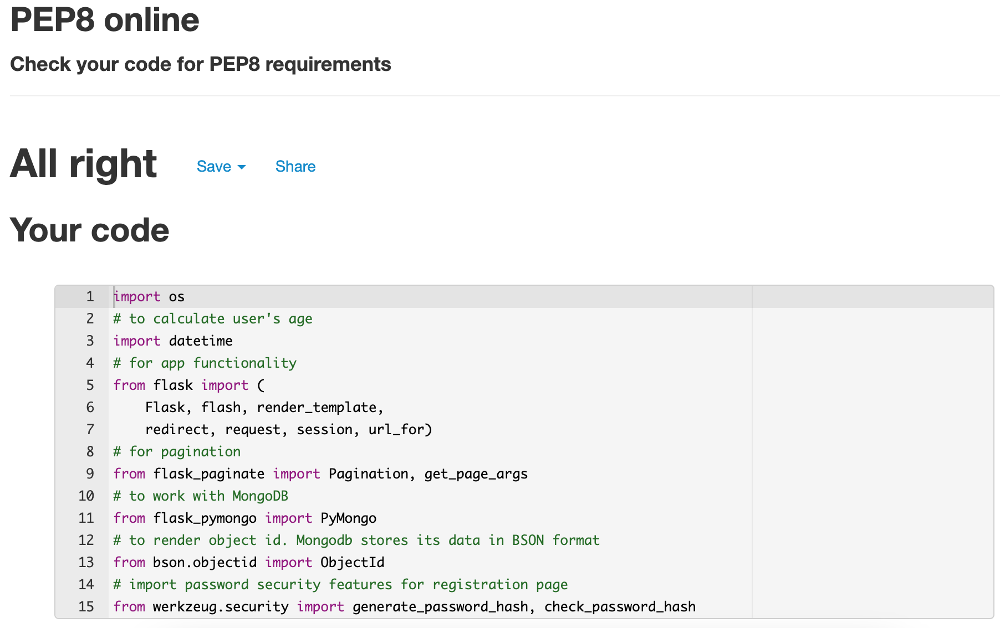

### Lighthouse
jokes.html, profile.html, users.html, add_joke.html, edit_joke.html, sign_in.html, and sign_up.html were all tested for performance using [Lighthouse](https://developers.google.com/web/tools/lighthouse).
The results were as follows:

#### Home Page
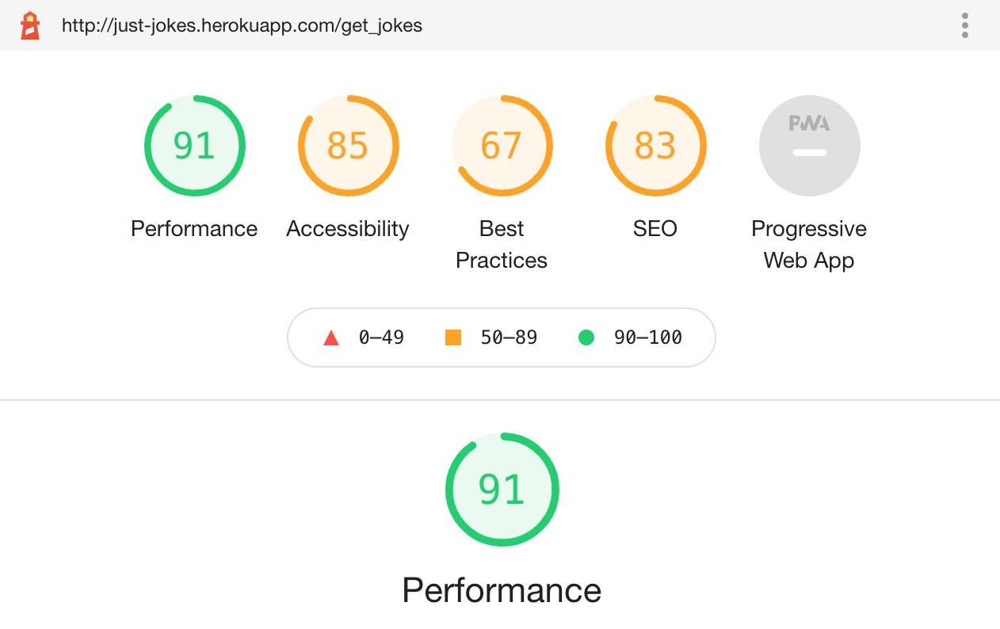

#### Profile Page
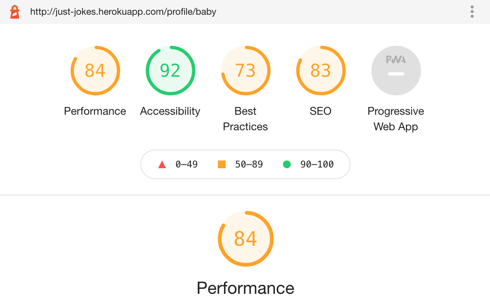

#### Users Page
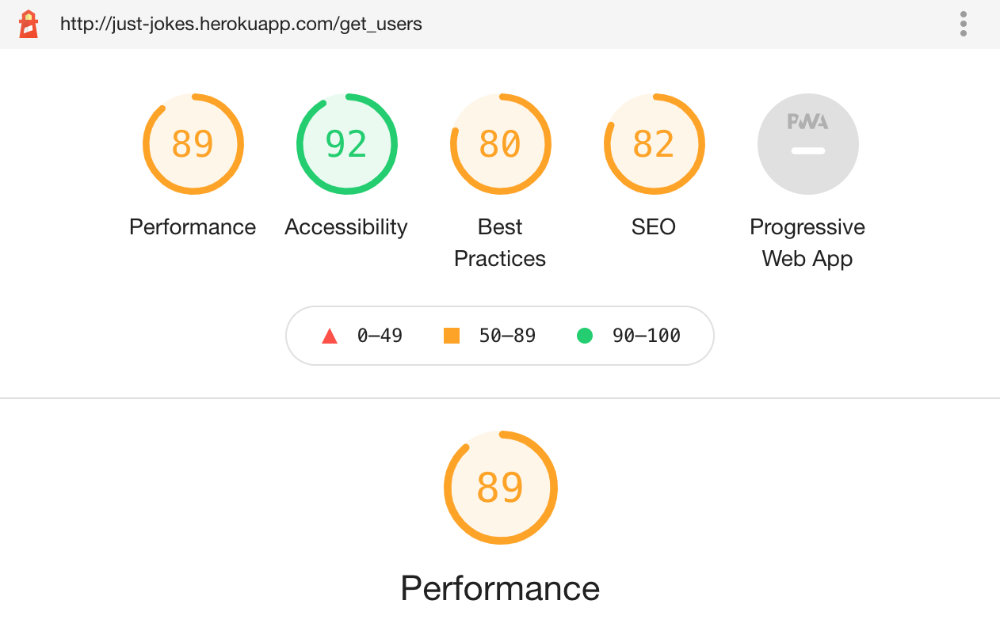

#### Add Joke Page
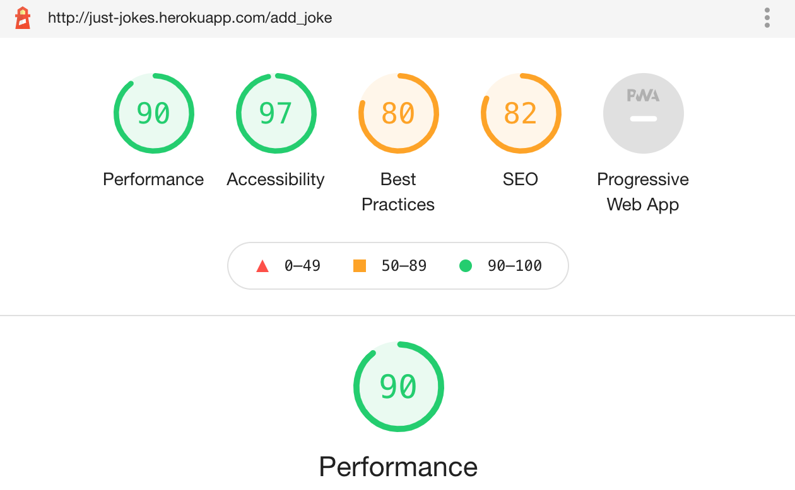

#### Edit Joke Page
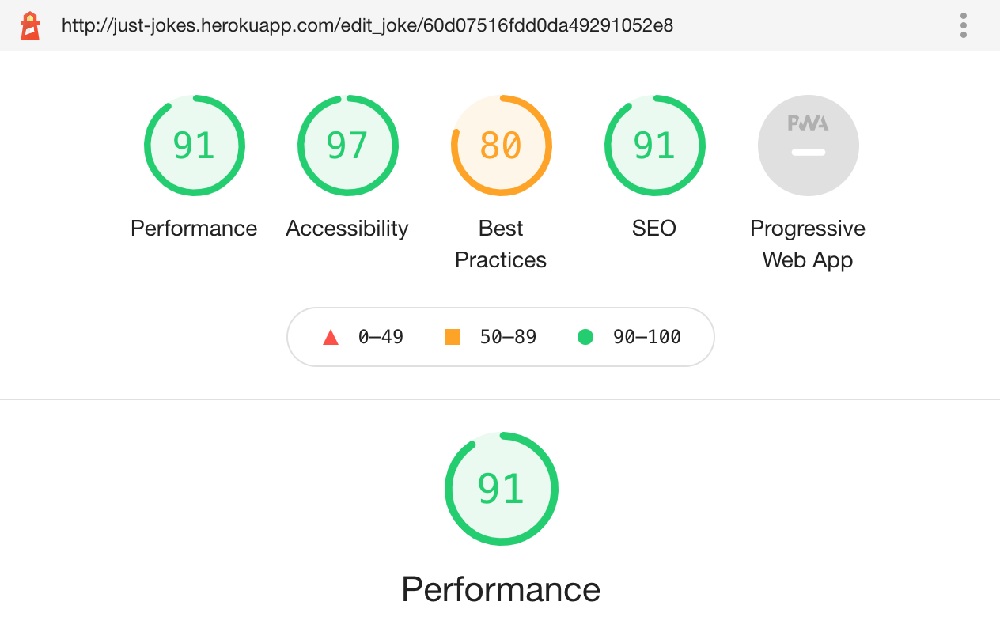

#### Sign In Page
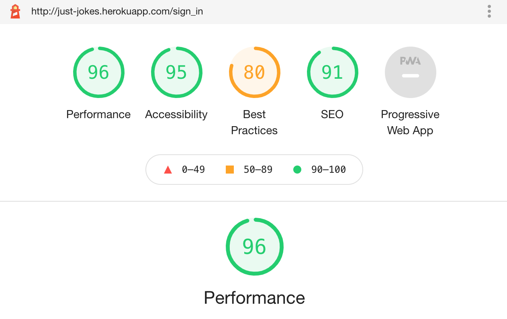

#### Sign Up Page

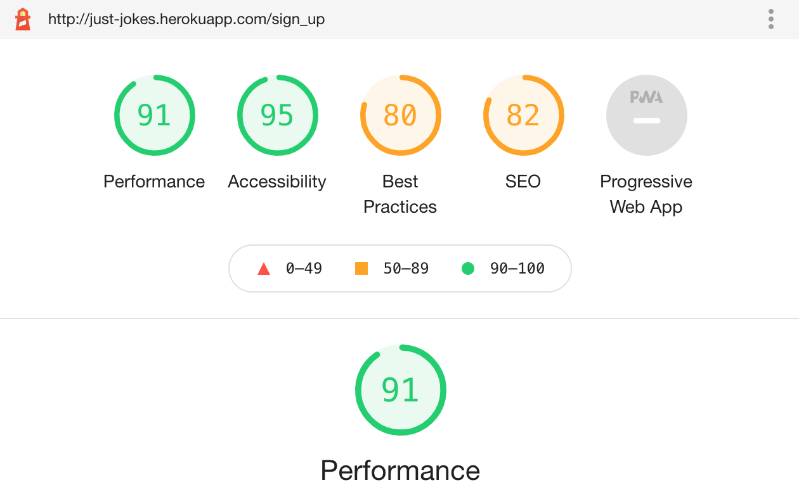

## Testing User Stories
### First Time User Goals 
1. As a first time user, I want to immediately understand the purpose of the site.
* Upon loading of the site, jokes are immediately visible. Even if the user is logged in, intuitive icons allow to users to understand that they can interact with the jokes by liking and favouriting them. 

    A header informs them that they can sign in to carry out these interections and to see more jokes

2. As a first time user, I want to be able to easily navigate through the site to find what I'm looking for.
* A sticky navbar ensures that any page available to the user is never more than a click away. Pagination minimises scrolling for smartphone users

3. As a first time user, I want to instinctively know what to do in order to get started creating and interacting with jokes.
* Intuitive fontawesome icons ensure users immediately know what to do in order to being liking jokes, adding jokes to their favourites, and adding their own jokes to the site.

4. As a first time user, I want to be able to read jokes.
* All users, including those who have not signed in, immediately have a range of jokes to read upon entering the site.

5. As a first time user, I want to be able upload jokes.
* Jokes can be uploaded easily from the navbar "Add Joke" menu item, which is always visible to signed in users. Users can also click the "Add joke" icon beside the search bar on the Home page to carry out this action.

6. As a first time user, I want to be able to edit my jokes.
* If the user has uploaded a joke, the joke will have an edit icon displayed on its card. Upon clicking, it will lead the user to a form where they can edit the joke's details. All the user's jokes can be found in one place in the "Your Jokes" section of their Profile. 

    Admins can also edit any joke they see fit.

7. As a first time user, I want to be able to delete my jokes.
* If the user has uploaded a joke, the joke will have an delete icon displayed on its card. Upon clicking, it will trigger a modal that will ask the user to confirm the deletion. Upon, confirming, the joke will be removed from the database.. 

8. As a first time user, I want to be able to "like" jokes.
* All jokes, apart from jokes that have been uploaded by the user themselves (unless the user in an admin), will have a like/laughing face icon displayed on their cards. Upon clicking, the colour of the icon will change, indicating that the "like" was successful. 

    The joke will be updated in the database, where the user's name will be added to a MongoDB array that displays the names off all the user's who liked this joke. The "likes" count of the joke will also be incremented by 1 in the database.

    The action can be undone upon clicking the icon a second time.

9. As a first time user, I want to be able to add jokes to a list of my favourites.
All jokes, apart from jokes that have been uploaded by the user themselves (unless the user in an admin), will have an add to favourites/heart icon displayed on their cards. Upon clicking, the colour of the icon will change, indicating that the joke was successfully added to the user's list of favourites.. 

    The joke will be updated in the database, where the user's name will be added to a MongoDB array that displays the names off all the user's who have added this joke to their list of favourites. 
    
    All of the jokes in the user's list of favourites can be found in one place in the "Your Favourites" section of the user's profile.

    The action can be undone upon clicking the icon a second time.

10. As a first time user, I want to be able to search for specific jokes.
* The Home page includes a seach bar that will return jokes that match the input of the user. Only the joke title and joke description are searchable.

### Returning User Goals
1. As a returning user, I want to be immediately familiar with the layout of the site.
* New jokes may be added all the time, but the layout will always have that familiar CRUD functionality. User's should know exactly what to do in order to carry out interactions with the site upon returning.

2. As a returning user, I want to be able to upload new jokes.
* There is currently no limit the the amount of jokes a user can add. User's can add a joke whenever they are logged in.

3. As a returning user, I want to be able to access the jokes I have uploaded.
* All jokes that a user has uploaded can be found in the "Your Jokes" section of their profile.

5. As a returning user, I want to be able to access the jokes in my list of favourites.
* All jokes that a user has added to their list of favourites can be found in the "Your Favourites" section of their profile.

6. As a returning user, I want to be able to remove jokes from my list of favourites.
* If the user has added a joke to their list of favourites, this should be indicated by the "add to favourites" icon being yellow. Upon clicking the yellow icon, the joke is removed from their favourites.

7. As a returning user, I want to be able to "unlike" jokes.
If the user has liked a joke , this should be indicated by the "like" icon being yellow. Upon clicking the yellow icon, the joke is "unliked".

### Site Owner Goals
1. As the site owner/admin, I want to be able to have additional features available to me.
* The site owner, has complete control over the content of the site as well as the users who access it.

2. As the site owner/admin, I want to be able to see all jokes that have been uploaded by users.
* All jokes uploaded to the database are visible from the admin's account. 

3. As the site owner/admin, I want to be able to delete any joke on the platform that I see fit.
* The delete icon will be available to the admin on all jokes.

4. As the site owner/admin, I want to be able to edit any joke on the platform that I see fit.
* The edit icon will be available to the admin on all jokes.

5. As the site owner/admin, I want to be able to access the information of all users of the site.
* The admin can access the Users tab in the navbar where they can see all users that have signed up to the site.

6. As the site owner/admin, I want to be able to remove any user I see fit from the site.
* Each card displaying a user in the Users page will have a delete icon. When clicked, the user will be removed from the database.

7. As the site owner/admin, I want to be able to search for specific users.
* The Users page includes a seach bar that will return users that match the input of the admin. The username and the date of birth of the user are both searchable.

## Testing Features
### Features Available to Adult Users, Underage Users, and Admin Users
#### Base Template Features
The following tests were carried out on features available to all users, bar signed out users:

1. Click the logo and validate that it navigates to the Home page.
2. Click the Home button in the navbar and validate that it navigates to the Home page.
3. Click the Profile button in the navbar and validate that it navigates to the Profile page.
4. Click the Add Joke button in the navbar and validate that it navigates to the Add Joke page.
4. Click the logo in the the footer and validate that it navigates to the Home page.
4. Click the Facebook logo in the the footer and validate that it navigates to Facebook.
4. Click the YouTube logo in the the footer and validate that it navigates to YouTube.
4. Click the Instagram logo in the the footer and validate that it navigates to Instagram.
2. Click the Sign out button in the navbar and validate that it signs the user out navigates to the Sign In page.

#### Home Page Features
The following tests were carried out on features available to all users, bar signed out users:

1. Click the Add Joke icon in beside the search bar and validate that it navigates to the Add Joke page.
3. If the user is an adult or admin, check to see that all jokes are displaying on the page.
4. If the user is under 18 or the user is not signed, validate that only jokes marked suitable for children are displaying.
5. If the user is an adult or is under 18, locate a joke that has not been uploaded by the user and validate that the joke is displaying the "Like" and "Add to favourites" icons.
6. If the user is an adult or is under 18, locate a joke that has been uploaded by the user and validate that the joke is displaying the "Delete joke" and "Edit joke" icons.
7. If the user is under 18, validate that only jokes marked suitable for children are displaying.
8. Validate that each joke is displaying the correct information.
9. If the joke is over 50 characters, validate that the joke is displaying a truncated version of the joke discription.
10. Click the "Expand" button and validate that:
    * A modal is triggered displaying the joke's details in full
    * The modal is canceled by clicking the cancel button in the top right of the modal
    * The modal is canceled by clicking outside of the modal
11. If the user is an admin, locate any joke that has not been liked, or, if the user is not an admin, locate a joke that has not been added by the user and has not been liked. Click the "Like" icon and verify:
    * That the page redirects to back to the Home page.
    * That a flash message displays "You've liked this joke!" at the top of the page.
    * That the joke's "likes" field in MongoDB has been incremented by 1.
    * That the user's name has been added to the joke's "liked_by" array field in MongoDB.
    * That the colour of the "Like" icon has changed to yellow.
12. Choosing the same joke as before, click the "Unlike" icon and verify:
    * That the page redirects back to the Home page.
    * That a flash message display "You've unliked this joke" at the top of the page.
    * That the joke's "likes" field in MongoDB has been decremented by 1.
    * That the user's name has been removed from the joke's "liked_by" array field in MongoDB.
    * That the colour of the "Add to favourites" icon has changed back to black.
13. If the user is an admin, locate any joke that has not been added to the user's favourites, or, If the user is not an admin, locate a joke that has not been added by the user and has not been added to the user's favourites. Click the "Add to favourites" icon and verify:
    * That the page redirects to back to the Home page.
    * That a flash message displays "Joke favourited!" at the top of the page.
    * That the user's name has been added to the joke's "favouriters" array field in MongoDB.
    * That the colour of the "Add to favourites" icon has changed to yellow.
14. Choosing the same joke as before, click the "Remove from favourites" icon  and verify:
    * That the page redirects back to the Home page.
    * That a flash message display "Joke removed from your favourites" at the top of the page.
    * That the user's name has been removed from the joke's "favouriters" array field in MongoDB.
    * That the colour of the "Add to favourites" icon has changed back to black
15. If the user is not an admin, locate a joke that has been uploaded by the user, click the "Delete joke" icon and verify:
    * That a confirmation modal is triggered, asking the user if they are sure they want to delete the joke.
    * That the modal displays the joke details.
    * That the modal provides "Cancel" and "Delete" buttons.
    * That the "Cancel" button closes the modal.
    * That the "Delete" button:
        * Removes the joke from the database
        * Redirects back to the Home Page
        * Displays the flash message "Joke removed" at the top of the page
16. If the user is an admin, locate any joke, or, if the user is not an admin, locate a joke that has been uploaded by the user. Click the "Edit joke" icon and verify:
    * That it redirects to the Edit Joke page.
17. Type a word found in a joke into the search bar and validate that a the corresponding joke is returned below upon clicking "Search".
18. Click "Clear" and verify that it redirects back to the Home page.

#### Profile Page Features
The following tests were carried out on features available to all users, bar signed out users:

1. Validate that the user's username is displayed at the top of the page.
1. Validate that a dropdown menu is displayed beneath the username.
1. Validate that the dropdown menu contains:
* See favourites
* See your Jokes
* Sign out
1. Validate that, upon clicking "See favourites":
    * The jokes in the user's favourites list are displayed below
    * The correct information is displayed on the jokes
    * The "Like" and "Add to favourites" icons are displayed on the joke card
1. Validate that, upon clicking "See your jokes":
    * The jokes the user has uploaded are displayed below
    * The correct information is displayed on the jokes.
    * The "Delete joke" and "Edit joke" icons are displayed on the jokes.
1. Validate that, upon clicking "Sign out":
    * The user is signed out and redirected to the Sign In page.
    * A flash displays the message "Signed out" at the top of the page
9. If the joke is over 50 characters, validate that the joke is displaying a truncated version of the joke discription.
10. Click the "Expand" button and validate that:
    * A modal is triggered displaying the joke's details in full
    * The modal is canceled by clicking the cancel button in the top right of the modal
    * The modal is canceled by clicking outside of the modal
11. Under "Your Favourites", if any jokes are present, locate any joke that has not been liked. Click the "Like" icon and verify:
    * That the page redirects to back to the Home page.
    * That a flash message displays "You've liked this joke!" at the top of the page.
    * That the joke's "likes" field in MongoDB has been incremented by 1.
    * That the user's name has been added to the joke's "liked_by" array field in MongoDB.
    * That the colour of the "Like" icon has changed to yellow.
14. Under "Your Favourites" "Remove from favourites" icon and verify:
    * That the page redirects back to the Home page.
    * That a flash message display "Joke removed from your favourites" at the top of the page
    * That the user's name has been removed from the joke's "favouriters" array field in MongoDB
    * That the colour of the "Add to favourites" icon has changed back to black
    * That the joke no longer appears under "Your Favourites"
15. Under "Your Jokes", if jokes are present, locate any joke. Click the "Delete joke" icon and verify:
    * That a confirmation modal is triggered, asking the user if they are sure they want to delete the joke.
    * That the modal displays the joke details.
    * That the modal provides "Cancel" and "Delete" buttons.
    * That the "Cancel" button closes the modal.
    * That the "Delete" button:
        * Removes the joke from the database
        * Redirects back to the Home Page
        * Displays the flash message "Joke removed" at the top of the page
    * That the joke no longer appears under "Your Jokes"
16. Under "Your Jokes", if jokes are present, locate any joke. Click the "Edit joke" icon and verify:
    * That it redirects to the Edit Joke page.

#### Add Joke Page Features
1. Validate that a form appears upon loading the page.
2. Validate that the form has the following fields:
    * Joke Title
    * Joke
    * Image URL
    * Suitable for children switch
3. Fill in the form with invalid information and validate the form does not submit:
    * Valid information for Joke Title:
        * minlength="3" maxlength="20"
    * Valid information for Joke Description:
        * minlength="4" maxlength="200"
    * Valid information for Image URL:
        * Currently no validation, but must be filled out.
4. Fill out the form with correct information and validate:
    * That the page redirects back to the Add Joke page
    * That a flash message displaying "Joked Added!" appears at the top of the page
    * That the joke appears somewhere in the Home page
    * That the joke appears under "Your Jokes" in the user's profile.
5. Fill out the form and click "Cancel" and verify that the form resets"
6. Upload two jokes, one with the Suitable for children switch "on", and one with the Suitable for children switch "off". Verify that:
    * Both jokes are visible when signed into an adult account.
    * The joke with the Suitable for children switch set to "off" is not visible when signed into an account that belongs to a user under 18 years of age.

#### Edit Joke Page Features
1. Validate that a form appears upon loading the page.
2. Validate that the form has the following fields:
    * Joke Title
    * Joke
    * Image URL
    * Suitable for children switch
1. Validate that the above fields are populated with the details of the joke that was clicked.
1. Click "Cancel" and verify that it redirects to the Home page.
3. Edit the pre populated fields, press "Clear" and validate that the form resets.
3. Edit the pre populated fields, press "Edit" and validate that:
    * It redirects to the Home page.
    * The joke appears somewhere in the Home page with its details changed.
    * The joke appears in "Your Jokes" in the user's profile with its details changed.

#### Sign In Page Features
1. Validate that a form appears upon loading the page.
2. Validate that the form has the following fields:
    * Usersname
    * Password
1. Validate that there is a solitary "Sign in" button below the form.
1. Validate that there is a link that leads to the "Sign up" page below that "Sign in" button.
3. Fill out the form with invalid details and verify that:
    * The page reloads
    * A flash message displaying "Incorrect username and/or password" appears at the top of the page.
4. Fill out the form with valid details and validate that:
    * It redirects to the user's profile
    * A flash message displaying "Welcome, 'username'" appears at the top of the page.

### Features Specific to Admin
The following tests were carried out on features specific to the admin:

1. On the Home page, click the "Users" tab on the navbar and validate that it navigates to the Users Page.
2. On the Home page, validate that all jokes display all options available to the admin; "Like", "Add to favourites", "Delete joke", "Edit joke".
3. On the Users page, check to see that all users are displaying.
4. On the Users page, click the "Delete user" icon and validate that a confirmation modal appears.
5. After the confirmation modal appears, click the cancel button and validate that the action is canceled.
6. Click the "Delete user" icon again, and this time click the delete button. Validate that the user is removed from the database, that the flash message "User removed" appears at the top of the screen and that the user is redirected back to the User's page.
7. On the Users page, type a username into the search bar and validate that a matching user is returned below.
8. On the Users page, type a date into the search bar and validate that users matching that date of birth are returned below.
9. Click "Clear" and verify that it redirects back to the Users page.

### Features Specific to Not-Signed-In Users:
1. Validate that the only options in the navbar are:
    * Home
    * Sign in
    * Sign up

#### Home Page
2. Validate that all jokes displaying have their for_children field in the database set to "on".
3. Locate any joke:
    * Click the "Expand" button and validate that:
        * It triggers a modal
        * The modal displays the message: "Want to see the full joke?"
        * The modal provides a "Sign in" button that leads to the Sign in page
        * The modal provides a "Nah" button that closes the modal
        * The modal closes when the close button at the top right hand corner of the modal is clicked
        * The modal closes when anywhere outside of the modal is clicked
    * Click the "Like" button and validate that:
        * It triggers a modal
        * The modal displays the message: "Sign in the like this joke"
        * The modal provides a "Sign in" button that leads to the Sign in page
        * The modal provides a "Nah" button that closes the modal
        * The modal closes when the close button at the top right hand corner of the modal is clicked
        * The modal closes when anywhere outside of the modal is clicked
    * Click the "Add to favourites" button and validate that:
        * It triggers a modal
        * The modal displays the message: "Sign in to favourite this joke"
        * The modal provides a "Sign in" button that leads to the Sign in page
        * The modal provides a "Nah" button that closes the modal
        * The modal closes when the close button at the top right hand corner of the modal is clicked
        * The modal closes when anywhere outside of the modal is clicked

#### Sign Up Page
1. Validate that a form appears upon loading the page.
2. Validate that the form has the following fields:
    * Username
    * Password
    * Date of birth
3. Fill in the form with invalid information and validate the form does not submit:
    * Valid information is outlined in form labels for Username and Password
    * No specific validation is implemented, this will be addressed in future versions.
4. Fill out the form with correct information and validate:
    * That the page redirects to the Home page
    * That a flash message displaying "You're sign up!" appears at the top of the page

### Features Specific to Smaller Screens
1. Click the burger icon to validate that the navigation links drop down.
2. Validate that the dropdown menu displays the same menu items and the menu on larger screens.
3. Validate that all menu items work correctly

### Other Features
1. Validate that, if there are more than 8 items to be displayed, they will be paginated, with a maximum of 8 items being displayed at a time.
2. Hover over all joke-action icons and validate that they rotate.
3. Hover over all links and validate that they slightly decrease in size.
3. Hover over all buttons and validate that they change colour.

The above tests were carried out on both smaller and larger screens and resulted in a pass.

## Site Responsiveness

[JustJokes](http://just-jokes.herokuapp.com/get_jokes) was tested across a range of devices and internet browsers to assess the responsiveness of the site. The site was also tested on all available devices in Google Dev Tools to ensure it was visually appropriate on all screen sizes.

The site was tested on the following devices: 

* MacBook Pro (Retina, 13-inch, Early 2015)
* iPhone 8 Plus
* Samsung Galaxy S10
* Huawei LYO-L01
* Windows 10(desktop)
* iPad Air

And on the following browsers: 

* Google Chrome 
* Safari 
* Opera 
* Samsung Internet

## User Testing

The site was tested by various peers and family members throughout the building process. Known bug were confirmed and some new ones pointed out. Appreciation was expressed for the functionality of the site.

## Known Bugs and Issues
* When trying to implement a search engine for jokes, I would get the following error: 'Cursor' has no len()
I realised that I had to convert the jokes retrieved from the database to a list using list()

* Upon implementing the Bootstrap modal on each card element to display the full joke, I discovered that, no matter what card was selected, the modal would always display the joke of the first card (which was the chicken joke). I tried various methods to rectify this.

    I started by setting the id of the modal and the data-target of the Expand button, to the joke id ( {{joke._id}} ). I thought this would help as I assumed that the problem stemmed from each modal having an identical ID. However, this did not work.

    I then attempted to rectify the issue by using variables inside the jinga for loop. I wrote  and used these variables in the both the modal and card to ensure that both the modal and card details would always be the same. Unfortunately, this produced the same result.

    To examine the problem further, I used the JavaScript and the chrome console to see if I could spot the problem. Interestingly, when I used JavaScript to console.log() the contents of both card and modal, the text of both the card and the modal were always identical.

    I didn’t understand why the modal presented to the user displayed different information to what was printed to the console.

    I then used JavaScript to set the innerHTML of the modal elements to the innerHTML of the card elements. Again, everything was displaying fine on the console, but not on the modal on the screen.

    To my surprise, when I built my own modal from scratch, the same problem occurred! Each modal would still display the text from the first joke, no matter what joke had been selected.

    The next step I took was to insert an onclick event listener directly into the button element that triggered the modal. It called the displayModal() function I had created before, but I passed in the jinja values from the for-loop. When I assigned the values of the modal to the values of the jinja values, and logged them to the console, I saw that the chicken joke would log to the console perfectly. Every other joke would get the error: “Uncaught SyntaxError: Invalid or unexpected token”

    I then thought the problem then lay with the jokes themselves. Upon inspection in MongoDB, the chicken joke was the only joke that was written on one line. I edited the fish joke to ensure it was also all on one line. When I refreshed the page, the fish joke logged to the console and was successfully inserted into the modal.

    I then reinstated the Bootstrap modal to see if it would work on the newly formatted jokes. Alas, it had the same issues as before. Only the chicken joke was displayed on the modal, no matter what card was clicked.

    I decided I would combine the Bootstrap modal with my onclick function, to see if I could could pass the card’s jinja values into the modal. This worked with the jokes that had been reformatted in MongoDB. However, if an unformatted joke was clicked, the modal would display the last correctly formatted joke that had been clicked.

    I decided that I would include a note for the user in the Add Joke form, telling them to ensure that their joke is one line only. This is a remaining bug that will have to be addressed in future versions.

    Just when I thought I was done with the problem, after I created the “add to favourites” functionality, I discovered that modals of the favourited jokes were not displaying any information other than the user who posted the joke. I speculated that the cause could be the duplication of ids on the "jokes" for loop and "fav_jokes" for loop on the one profile page.

    After addressing that, our friend, the chicken, once again appeared on every modal, and only the title. I went about changing the names of the "fav_jokes" modal classes and updating the displayModal() function to target them as well as the "jokes" modal classes. The problem was solved. 

* Another major problem I had occurred after I had implemented the age restrictions. I changed the names and ages of two accounts I had created to reflect an over 18 user and and under 18 user, for testing purposes. When trying to log back in with these user details (I hadn’t changed passwords) I was greeted with errors. 

    I manually typed in the url for the sign up page and created a new account for an adult. When I was logged in, everything was displaying correctly. I attempted to add a few jokes to my favourites. The first 4 went fine, until I got to the 5th where I got an error: “TypeError: 'NoneType' object is not subscriptable”. 

    I pressed the back arrow and went to my profile. The jokes that seemed to be successfully favourited were not in my profile. I tried to favourite them again. I started with the first 4 and each time the flash said “joke already favourited”. I tried with the next few and got the same errors as before. I saw that the jokes that didn’t caused the error were all in the database (under the previous account I had been using, under the old name). 

    The variables in the add_fav() view must have been read, otherwise the flash telling me that the jokes has already been favourited would not be displayed. I noticed that the joke_teller and joke_favouriter of these jokes were the two accounts whose details I changed. I changed the usernames back and was able to log in with them. 

    However, the problem remained. Getting more familiar with how to problem solve, I printed the values of both "joke" and "already_favd" variables to see which one was giving the error. I realised that already_favd was None because it didn’t exist in the database at the time of favouriting. Although, this wasn’t a problem when I first wrote the code and was adding jokes into the user_favourites collection. Nonetheless, I changed my if statements from 'if jokes[“joke_description”] ==  already_favd[“joke_description”]' to 'if already_favd', and the system was back working.

* Another issue occurred when I implemented the “like” functionality. I wanted to ensure that users could only like a joke once. Thinking this would be a quick feature to implement, I created two like buttons for each card. One would display if the user hadn’t liked the joke, and the other would be hidden. If the user liked the joke, the like would be recorded in the database and a JavaScript function would swap the buttons. If the second button was pressed, the like would be removed from the database the the JS function would swap the buttons back.

* This didn’t work. I spent a long time trying to figure out why, redesigning the functions, redoing the HTML, etc. When logging the event listeners of the buttons to the console, nothing was showing up. I changed the event listener to be on the document, rather than on the buttons, and set the event.target.classname to the buttons.

* This proved slightly more useful, as the event would log to the console, but only for a split second. I realised this was because of the "redirect" return statement in the like_joke() view in app.py. It reloaded the page every time the like button was clicked. I supposed that the script.js function didn’t have time to carry out its functionality before the page was loaded. I decided to redesign by like_joke() view and simply inform users if they had already liked the joke. Eventually, it was redesigned again to its current state, where pressing the "Like" button a second time would reverse the "liking" process.

* I had initially designed the add_fav() view to add the joke, along with the user’s name as an identifier, to a new collection named “user_favourites”. This system seemed to be working fine while I continued building the project. However, upon logging in under another user, I realised that this would just add multiple versions of the same joke to the collection, each with its own “favouriter”. This resulted in the user being told they had already liked the joke, when they hadn’t. 

    I had since created the like_joke() view with a more effective method, by adding a “liked_by” field to the jokes collection, which was an array of users who had liked the joke. So, I decided to re-do the add_fav() view using a similar method. This turned out to be a bigger undertaking than expected, and resulted in me having to update several other functions accordingly.

* Calculating the user’s age proved to be a major challenge. I painstakingly designed my own method of calculating wether the user was over 18 or not. It didn’t work effectively. Then, I discovered datetime, and the rest is history!

* Another issue I was having was passing variables between views. I couldn’t seem to call views inside other views to get their values. One particular value that I needed in multiple views was the user’s age. I decided to created an external function with no decorators that only returned the user’s age. I was able to call this function and assign it to variables inside other functions to access the user’s age.

* Implementing age restrictions was another task that proved bigger than expected, and multiple other views had to be updated to accommodate it

    Implementing the age restrictions caused errors, also. For example, jinja if statements had to be modified because they were now causing errors if there was no user in session. This is because the age restriction were based off the user’s age. If there was no user, the if statements (eg: if user.age >= 18) would cause errors.

* A big bug arose while validating my code. When put through the validator, 85 errors appeared concerning duplicate IDs. I went through the code and gave new names to the data-targets and corresponding modal IDs to ensure each one was unique. This didn’t rectify the issue. I then realised the issue came from the fact that there were multiple cards on the html page, rather than any issues with my code.

    I went about adding the joke id to each of the data targets and corresponding modal IDs with jinja, like I had done earlier in the project (as mentioned above). This resulted in the modals not working. Upon inspection in Chrome, I could see that the data targets and ids were perfectly fine, but the modals were still not displaying. 

    After a considerable amount of time experimenting with the code, I found that, even though the jinja joke IDs were displaying on the html, the modals would not respond. I would even copy and paste the jinja IDs directly from the dev tools and paste it into my own code. If I did this, it would work. However, I obviously could not do this for every joke on the webpage.

    A friend suggested I move the modals outside of the for loop. This way, there would only be one modal and I would not have to worry about duplicate ids. This worked fantastic for the expand modal, which displayed the full joke. However, when it came to the delete modal, more time consuming issues arose. 
    
    Nothing would display on the modals. A separate onclick function was written for the delete modal, almost identical to the one for the expand function, with the additional parameter of “id”. “Id” was for the url_for "href" that passed the joke id to python for it to be deleted.

    Nothing would display on the modal, however, only the “posted by”, which seemed to display whether I inserted it into the modal or not. The HTML message that was written jokes.html would also display. I tried creating the elements within the Javascript. I created all the h and p elements needed, appended the correct content, and then inserted them into the modal. This worked. However, it would duplicate the code every time I would click the delete icon. After three clicks, there would be three jokes displayed on the modal, etc.

    After much experimenting, I decided to move it back to its original position in the for loop, only to find that it was displaying incorrect information. It was just displaying the joke title multiple times, instead of the other details. 
    
    I moved it back outside the loop and decided that I didn’t need to display the joke on the modal. I only needed the confirmation message and include the delete button. I redesigned the javascript function to take in the joke's id, create the url_for('delete_joke') href, and insert it into the modal. Again, it looked fine on dev tools, but would lead to a 404 error. 

    The see full jokes were working fine outside the loop, so I decided to move the delete modals back inside the loop, again. However, this time I kept them outside of the card, but still inside the loop. Before they had been placed directly under the button that triggered. Then, I removed the onclick functions and reinstated all the jinja variables. I also put {{joke._id}} back as the data-target of the button and matching modal ID. Finally, the bug was solved.

    Modals and chickens are now my enemies.

## Known Bugs and Issues
* As mentioned above, jokes that are not uploaded to the database on one line, don't display correctly on the modals. While I find a fix for this, users are asked to upload jokes on one line, only.

* The reloading of the pages after clicking the "Like" or "Add to favourites" buttons isn't great user experience. It leads to users having to scroll back to where they previously were. Future versions would ensure the page doesn't reload when clicking joke action buttons.

* Currently the calendar in the sign up form will submit without a value. This could potentially be a problem as the age restriction aspect of this site is very central to the code. Future versions would find a better alternative to this calendar.